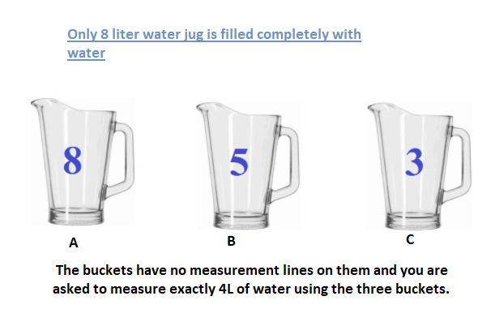

# Problem_solving_with_python
> The three Gallon Problem : Suppose you have 8L, 5L and a 3L bucket with you, The buckets have no measurement lines on them and you are asked to measure exactly 4L of water using the three buckets. How could you measure exactly 4L water using only those buckets?
-------------------------------------------------

## General Solution

## Binder 

